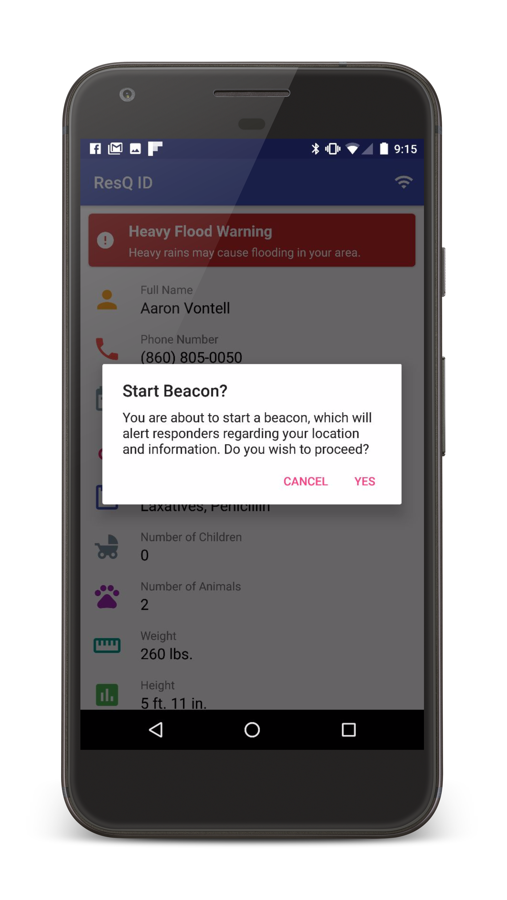
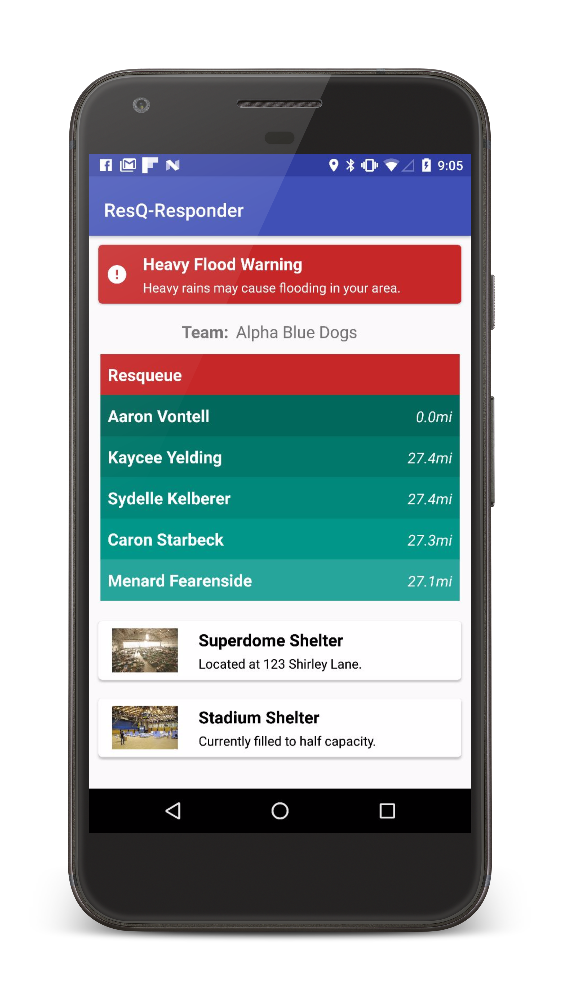

# ResQ-Server
*Winner of [HACKMIT](hackmit.org) '17 Made From Scratch Prize.*
.png)
## Screenshots

Sample of the ResQ User beacon.

Sample of the ResQ Responder AR View.

Sample of the ResQ Responder map view.

Sample of the ResQ Responder main view including the ResQueue.

Sample of the ResQ user application (our Medical ID).

## API
The following routes are documented.
- `/auth/update-user`
- `/auth/user`
- `/auth/firstresponder`
- `/location`

1. `/api/auth/user` is used to create a new user object. It accepts a valid JSON user and returns the success of the creation. 

    Expected request: 
    ```json
    {
        "name": "Aaron Vontell",
        "medicalConditions": ["Obesity II", "Diabetes"],
        "allergies": ["Peanut Butter", "Cats"],
        "medications": ["Laxatives", "Penicillin"],
        "weight": 260,
        "height": 71,
        "age": 20,
        "kids": 0,
        "animals": 0,
        "spouse": false,
        "transportation": false,
        "evacuate": true
    }
    ```
    Expected Response: 
    ```json
    {
        "success": true,
        "authorizationKey": 6096b5b3591e314121e50c2c4ab9f18e13c8bc8819a37c42645ecf834e415d53
    }
    ```

2. `/api/auth/firstresponder` is used to create a new responder object. It accepts a JSON responder, and returns the success of the creation.

    Expected request:
    ```json
    {
        "name": "Cooper Pellaton",
        "hasBoat": false,
        "hasCar": false,
        "physicality": 0
    }
    ```

    Expected response: 
    ```json
    {
        "success": true,
        "authorizationKey": e46af91c282b02d740e9fe4d258ddc75ef0292230eb6fb253450f189ff8817a7
    }
    ```

3. `/api/location` is used to provide user location updates. It expects to recieve a valid JSON location, and returns the success of the update.

    Expected request:
    ```json
    {
        "lat": 42.359221,
        "long": -71.093003
    }
    ```

    Exepcted response: 
    ```json
    {
        "success": true,
        "authorizationKey": 7792b27e6d8cd1af92e9f1adc75059697cf72a6945851916f9533131d89d18ca
    }
    ```